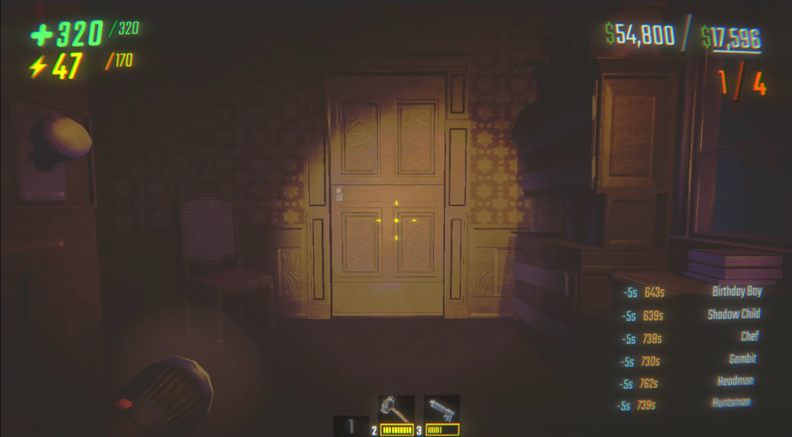
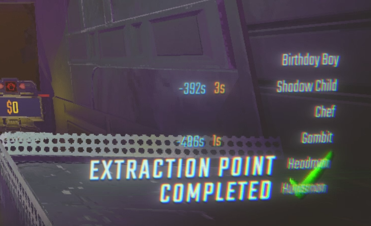

# Monster Respawn Timer

[English](#english) | [中文](#中文)

## 中文

Monster Respawn Timer 是一个 R.E.P.O. 的 BepInEx HUD 模组。它会在游戏内显示当前关卡会出现的怪物、怪物什么时候复活，以及哪些事件正在影响怪物的复活时间。



### 显示内容

- 右下角显示当前关卡的怪物名称。
- 橙色数字表示这个怪物还有多久复活。
- 蓝色数字会短暂闪烁，表示游戏刚刚让怪物复活时间减少了多少秒，例如打碎物品、使用武器、valuable items 发出的声音、激活或完成 extraction point 等事件。
- Gnome 和 Banger 这类成组出现的怪物会放在同一行，但每个怪物仍然保留独立的复活计时。
- 观战时会隐藏 HUD，避免挡住原本的观战界面。



### 安装

推荐使用 Thunderstore Mod Manager 或 r2modman 安装。

手动安装时，先安装 R.E.P.O. 的 BepInExPack，然后把 `MonsterRespawnTimer.dll` 放到：

```text
BepInEx/plugins/
```

如果你从 GitHub 下载，编译好的 DLL 在 `dist/MonsterRespawnTimer.dll`。

### 说明

这个模组只显示游戏已经存在的怪物状态和复活计时，不会改变怪物生成、死亡、despawn 或复活逻辑。

## English

Monster Respawn Timer is a BepInEx HUD mod for R.E.P.O. It shows which monsters can appear in the current level, when dead or despawned monsters will respawn, and which events are changing those respawn timers.


### What It Shows

- Monster names for the current level in the bottom-right HUD.
- Orange numbers show how long a monster has until it respawns.
- Blue numbers briefly flash when the game reduces a monster respawn timer, such as from broken objects, weapon use, valuable item noise, or extraction point events.
- Swarm monsters such as Gnome and Banger are grouped on one row, while each monster still keeps its own independent respawn timer.
- The HUD hides while spectating so it does not cover the default spectator UI.


### Installation

Thunderstore Mod Manager or r2modman is recommended.

For manual installation, install the R.E.P.O. BepInExPack first, then place `MonsterRespawnTimer.dll` in:

```text
BepInEx/plugins/
```

If you download from GitHub, the built DLL is available at `dist/MonsterRespawnTimer.dll`.

### Notes

This mod only displays monster state and respawn timer information that already exists in the game. It does not change monster spawning, death, despawn, or respawn logic.
